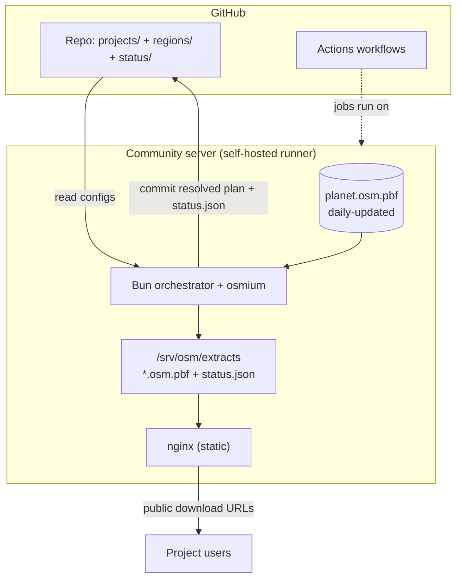

# Plan: OSM PBF filter & extract service

> Working design for discussion. Nothing here is implemented yet — this document
> plus the example configs in [`projects/`](projects/) and [`regions/`](regions/)
> are the whole repo today.

## 1. Goal

Run a service on a **community OSM server** that:

1. Keeps a full-planet OpenStreetMap `.osm.pbf` file **updated daily** from the
   OSMF replication diffs.
2. Produces, **once per day**, a set of small **per-project extracts** — each
   filtered by **area** (a polygon) and by **tags** (osmium key/key=value
   filters).
3. Serves those extracts over **stable public download URLs**, each accompanied
   by machine-readable info about **how old the data is**.
4. Is driven entirely from **this git repository**: you add/edit configs, push,
   and the rest happens automatically — with **as little manual server access as
   possible**.

The chosen way to achieve point 4 is to register the community server as a
**self-hosted GitHub Actions runner**. All logic then lives in workflow YAML +
scripts in this repo; the only thing that runs "on the server" is the runner
agent itself.

---

## 2. Decisions made (and why)

| Topic | Decision |
|---|---|
| CI platform | **GitHub Actions** with a **self-hosted runner** on the community server. |
| Extract storage / serving | **nginx** static file server on the community server. Stable URLs + real HTTP headers. **Binaries are not committed to git** — only configs + resolved plan + `status.json` are. |
| Region hierarchy | **Static tree** (world → continents → countries) defined in [`regions/regions.yaml`](regions/regions.yaml). Continents/countries are **activated** only when a project needs them. Only **tag filtering is dynamic** (union per active node). |
| Orchestrator language | **Bun** (TypeScript). |
| Extract tool | **osmium-tool** (`osmium extract`, `osmium tags-filter`); **pyosmium** for updates. |
| Server | **FOSSGIS e.V. uMap instance at Hetzner**, ~585 GB disk (see §3 / §A1). Shared with uMap. |
| Repo visibility | **Public** — makes the runner hardening in §A3 mandatory. |
| Doc language | English. |

---

## 3. Target environment

### Known facts

- **Planet size: ~87 GB.** `planet-latest.osm.pbf` is **87 GB** (compressed) —
  source: [planet.openstreetmap.org](https://planet.openstreetmap.org/). All
  sizing below uses this figure (and it grows over time).
- **Server: the FOSSGIS e.V. uMap instance, hosted at Hetzner.**
  - **Disk: ~585 GB.**
  - Hosted at **Hetzner**; **shared** with the uMap service (we are a tenant on
    an existing box, not a fresh server).
  - Maintained by **Lars Lingner** and the FOSSGIS OSM-server admin group; setup
    scripts live under the FOSSGIS GitHub account, and detailed server docs are
    in the FOSSGIS GitLab.
  - Sources:
    [Förderantrag uMap-Instanz](https://www.fossgis.de/wiki/F%C3%B6rderantr%C3%A4ge/umap_instanz),
    [FOSSGIS IT-Technik](https://www.fossgis.de/wiki/IT-Technik),
    [Benutzer:Lars Lingner](https://www.fossgis.de/wiki/Benutzer:Lars_Lingner),
    [OSM wiki: FOSSGIS/Server](https://wiki.openstreetmap.org/wiki/FOSSGIS/Server).
- **Repo visibility: public.** This makes the self-hosted-runner hardening in
  §A3 **mandatory, not optional**.

### Still to confirm

- **CPU / RAM and disk type** of the uMap server — not publicly documented; check
  the FOSSGIS GitLab or ask Lars Lingner. osmium is I/O-heavy, so SSD vs HDD is
  the single biggest speed factor.
- **Public download host + TLS** — which domain serves the extracts and who
  manages DNS/cert (the uMap instance already has a hostname we may be able to
  reuse, e.g. a subdomain).
- **OSMF diff timing** — what time daily replication diffs are reliably available
  (drives the cron in §C2).
- **Runner `sudo` scope** — is the runner allowed a single
  `systemctl reload nginx` (only needed for custom data-age headers, §B5)?

---

## 4. Architecture at a glance



Two halves, covered separately below:

- **Part A — Server provisioning** (the infrastructure you said you don't know).
- **Part B — How the application works** (data + extraction logic).
- **Part C — CI/CD workflows** (the glue that runs B on A).

---

# Part A — Server provisioning

The whole point: do this **once**, by hand, then never touch the server again for
normal operation. Capture every step as a script in `server/` so re-provisioning
is reproducible.

## A1. The server (FOSSGIS uMap instance) & disk budget

This runs on the existing **FOSSGIS e.V. uMap server at Hetzner** (sources in §3),
**shared** with the uMap service. Known: **~585 GB disk**; CPU/RAM/disk-type to be
confirmed via the FOSSGIS GitLab or Lars Lingner.

Disk budget against the **87 GB** planet:

| Item | Approx. size |
|---|---|
| `planet.osm.pbf` (live) | ~87 GB |
| Re-seed headroom (old + new planet during atomic swap) | up to ~87 GB extra |
| Intermediate extracts in `work/` (e.g. Europe ≈ 30 GB) | tens of GB, transient |
| Final per-project extracts in `extracts/` | small–moderate, persistent |
| **Plus whatever uMap already uses on the same disk** | unknown — confirm |

→ **585 GB is comfortable for normal daily operation.** The tightest moment is a
**re-seed** (briefly ~2× planet ≈ 174 GB) on top of uMap's existing usage — so
confirm free space before the first re-seed, and have the daily workflow **guard
on free disk** (§A6).

- **OS / disk type:** Hetzner default (Ubuntu/Debian assumed); SSD vs HDD is the
  biggest osmium speed factor — confirm both.
- **Coexistence:** keep everything under `/srv/osm/`, clean up `work/` after each
  run, and cap transient usage so we never starve uMap of disk or I/O.

## A2. Software to install (one-time)

| Package | Purpose |
|---|---|
| `osmium-tool` | extract + tags-filter |
| `pyosmium` (`pyosmium-up-to-date`) | apply daily replication diffs to the planet |
| `bun` | run the orchestrator |
| `git` | checkout repo (the runner does this) |
| `nginx` | serve extracts |
| GitHub Actions runner | execute workflows on this machine |

[`server/bootstrap.sh`](server/bootstrap.sh) installs all of the above and creates
the directory layout in A4.

> **Provision with Ansible, following FOSSGIS conventions** (feedback). The FOSSGIS
> server fleet is managed centrally and their infra docs/playbooks live in the
> FOSSGIS GitLab — so the production path should be an **Ansible role** that the
> admins can fold into their existing setup, not a one-off shell script run by hand.
> `bootstrap.sh` stays as a readable, reviewable reference of exactly what the role
> must do (packages, dirs, user, nginx site, runner registration); porting it to
> `server/ansible/` is an open TODO (§7), to be aligned with the FOSSGIS admins.

## A3. Self-hosted GitHub Actions runner ⚠️ security (mandatory)

The repo is **public** and the runner sits on a **shared FOSSGIS server that also
runs uMap**. A self-hosted runner executes whatever a workflow tells it to — so on
a public repo this is the highest-risk part of the whole design, and the
mitigations below are **required**, not optional. GitHub itself recommends
*against* self-hosted runners on public repos unless locked down, because anyone
can open a pull request that would otherwise run code on the box.

**Install + isolate**
- Run the runner as a **dedicated unprivileged user** (e.g. `osmrunner`) via a
  **systemd service**, registered with the label `osm`
  (`runs-on: [self-hosted, osm]`).
- **No passwordless full `sudo`.** At most one allow-listed
  `systemctl reload nginx` (only if we adopt custom headers, §B5).
- Confine our footprint to `/srv/osm/` with restrictive permissions so a
  compromised job can't reach uMap's data.

**Never run untrusted PR code**
- Settings → Actions → General → **Fork pull request workflows → Require approval
  for all outside collaborators**.
- Gate the pipeline workflows to safe triggers only: `push` to `main`,
  `schedule`, `workflow_dispatch` — **never** `pull_request` from forks.
- Run any PR-validation (e.g. config linting) on **GitHub-hosted** runners, not
  the self-hosted one. Consider a dedicated runner group so only the pipeline
  workflows can target `osm`.

**Reduce drift / exposure**
- Prefer **ephemeral** runners (clean checkout per job) + auto-update.
- `GITHUB_TOKEN` **read-only by default**; grant `contents: write` only on the
  commit step.
- Firewall: expose only 80/443 (nginx); the runner needs **outbound** to GitHub
  only (no inbound).

**Packages & docs (for manual setup / further research)**
- [Hosting your own runners — how the self-hosted runner feature works (start here)](https://docs.github.com/en/actions/hosting-your-own-runners)
- [Runner application releases](https://github.com/actions/runner/releases) — the
  package to download and install on the server.
- [Adding a self-hosted runner](https://docs.github.com/en/actions/how-tos/manage-runners/self-hosted-runners/add-runners)
- [Running the runner as a systemd service (`svc.sh`)](https://docs.github.com/en/actions/hosting-your-own-runners/managing-self-hosted-runners/configuring-the-self-hosted-runner-application-as-a-service)
- [Self-hosted runners reference](https://docs.github.com/en/actions/reference/runners/self-hosted-runners)
- [Managing self-hosted runners (overview)](https://docs.github.com/en/actions/hosting-your-own-runners/managing-self-hosted-runners)

Install flow (summary): download + unpack the runner package from the releases
link → `./config.sh --url https://github.com/<org>/<repo> --token <token> --labels osm`
→ `sudo ./svc.sh install osmrunner && sudo ./svc.sh start`. (See `server/bootstrap.sh`
for the deps; runner registration is interactive and stays manual by design.)

> Because the box also hosts uMap, this setup must be coordinated with **Lars
> Lingner / the FOSSGIS OSM-server admins** before registering the runner.

**Status of these controls (what's enforced where):**
- ✅ Code-enforced now: untrusted code never hits the self-hosted runner
  ([daily.yml](.github/workflows/daily.yml)/[seed-planet.yml](.github/workflows/seed-planet.yml)
  trigger only on `schedule`/`workflow_dispatch`; tests run on GitHub-hosted runners
  in [ci.yml](.github/workflows/ci.yml)); least-privilege token + no persisted
  credentials on the shared box; one-shot push token.
- ⚙️ Manual one-time (provisioning/repo settings): dedicated unprivileged user, no
  sudo, firewall, and the repo toggle **Settings → Actions → Require approval for
  outside collaborators**.
- 🔜 Open hardening TODOs (§7): prefer an **ephemeral** runner (fresh workspace per
  job) and a dedicated **runner group** so only these workflows can use the `osm`
  label.

## A4. Directory layout on the server

```
/srv/osm/
  planet/
    planet.osm.pbf          # the daily-updated full planet
    sequence.state.txt      # replication state (managed by pyosmium-up-to-date)
  work/                     # scratch space for intermediate extracts (gitignored)
  extracts/                 # nginx web root  ->  https://osm.example.org/extracts/
    osm-boundary-check/
      latest.osm.pbf        # stable filename, overwritten in place each run
      status.json
    index.json              # listing of all projects + timestamps
```

The repo is checked out into the runner's work dir by `actions/checkout`; the
orchestrator reads configs from there and writes outputs into `/srv/osm/`.

## A5. nginx

Serve `/srv/osm/extracts` as static files (config:
[`server/nginx-osm-extracts.conf`](server/nginx-osm-extracts.conf)) with autoindex
off and:

- `Last-Modified` (from file mtime = when the extract was produced) — enables
  conditional GETs / caching.
- `Accept-Ranges: bytes` for resumable large downloads.
- Long-lived files have stable URLs (see B7), so clients can cache by URL.

Example server block sketch:

```nginx
server {
    listen 443 ssl;
    server_name osm.example.org;
    root /srv/osm/extracts;

    location / {
        add_header Accept-Ranges bytes;
        add_header Cache-Control "public, max-age=3600";
        # status.json next to each file carries the authoritative data-age info.
        try_files $uri =404;
    }
}
```

(Custom `X-OSM-*` data-age headers are an optional enhancement — see B5.)

## A6. Ongoing maintenance (kept minimal)

- **Disk monitoring** — a workflow step fails loudly if free space drops below a
  threshold (planet growth is the main risk).
- **Runner health** — systemd restarts it; GitHub shows it offline if down.
- **No app deploys** — logic changes ship by merging to `main`; the runner picks
  up the new workflow/scripts on the next run.

## A7. Access model & residual root tasks (feedback)

The target is exactly what was asked: **Lars provisions once (root), then almost
everything runs through the runner as a non-root user.** Concretely:

- **Root access:** Lars **plus a second admin as fallback** (bus factor). Both via
  the FOSSGIS admin setup; no shared passwords.
- **The runner runs as an unprivileged user** (`osmrunner`) with **no sudo**
  (§A3). Day-to-day pipeline changes ship by merging to `main` — no server login.
- **What still needs root occasionally** (not coverable by the runner):
  OS/security updates, the GitHub runner agent's own updates, TLS issuance/renewal
  (certbot automates renewal), nginx/Ansible changes, and incident debugging.
  These are rare and shared between the two admins.

So: **yes, one-time install + runner is enough for normal operation**, but plan
for a couple of root touchpoints a year and a documented second admin.

## A8. Observing server load (feedback)

Two layers, because the box is shared with uMap:

1. **Reuse FOSSGIS's existing host monitoring** — confirm what they run (Munin /
   Prometheus+Grafana / Netdata) and watch CPU, **RAM**, disk space, and **disk
   I/O** there. We should hook into it, not run a parallel stack. (Open TODO §7.)
2. **Per-run metrics from the pipeline itself** — we already record update/extract
   timings (§B5). Extend the runner steps to also capture **peak RAM (max RSS)**
   and **wall time** per osmium step (`/usr/bin/time -v`) and free-disk before/after,
   and print them to the Actions log + `$GITHUB_STEP_SUMMARY`. That gives a public,
   per-day record of resource cost without server access.

**Protecting uMap during the run:** run osmium under `nice`/`ionice` so it yields
CPU and disk I/O to uMap, and **schedule off-peak** (see §B8). Alert (via the
FOSSGIS monitoring) if a run pushes memory or disk past a threshold.

---

# Part B — How the application works

## B1. Planet data lifecycle

Two operations on `/srv/osm/planet/planet.osm.pbf`:

1. **Daily update (automatic).** Apply the OSMF replication diffs to bring the
   planet up to date:
   ```bash
   pyosmium-up-to-date /srv/osm/planet/planet.osm.pbf
   ```
   `pyosmium-up-to-date` tracks the replication sequence number itself and pulls
   the needed daily/hourly diffs. This runs first in the daily workflow (§C2).

2. **Re-seed (manual, on a button press).** Download a fresh planet from scratch
   (e.g. after corruption, or to reset history). Triggered by a separate
   `workflow_dispatch` workflow with a typed confirmation (§C3):
   ```bash
   # download planet-latest.osm.pbf + .md5, verify checksum, atomically replace
   ```
   This is **never** automatic.

After every update we record the data's own timestamp:

```bash
osmium fileinfo -e -g data.timestamp.last /srv/osm/planet/planet.osm.pbf
# -> the osmosis_replication_timestamp: the real "as-of" date of the OSM data
```

## B2. Project configuration

Each project is a folder under [`projects/`](projects/) with a `config.yaml`
declaring an **area** and **tag filters**. Full schema and two worked examples
are in [projects/README.md](projects/README.md). Minimal example:

```yaml
# project id = folder name (no `name:` field); full field list — description,
# repository, homepage, contact — is in projects/README.md
description: Administrative boundaries for Germany.
area: { region: germany }
filters:
  - nwr/boundary=administrative
  - nwr/admin_level
```

## B3. The static region tree + activation

Defined in [`regions/regions.yaml`](regions/regions.yaml):
`world → continents → countries`, each with a polygon.

**Polygon format: GeoJSON** (preferred over osmium's `.poly`), because it's a
standard format we can lint and reuse. osmium accepts GeoJSON for both
`osmium extract -p …` and the multi-extract config. Each polygon **must** be a
GeoJSON `Polygon` or `MultiPolygon` (a `Feature`/`FeatureCollection` wrapping one
is fine) — see "Input validation" below.

Why a tree at all: cutting Germany directly from the 87 GB planet means reading
the whole planet **per project**. Layering (`world → europe → germany`) means the
expensive planet read happens **once**, then each continent is read once, etc.

What's **static**: the shapes/parents in `regions.yaml`.
What's **dynamic** (computed each run from the project configs):

- **Activation** — a continent/country is built **only if** a project's area is
  inside it. If no project touches Africa, Africa is never extracted.
- **Tag union** — each intermediate node keeps only the **union** of tags needed
  by the projects beneath it (see B4).

Resolving a project to a chain:

- `area.region: germany` → follow `parent` links in `regions.yaml`
  (`germany → europe → world`).
- `area.polygon: ./x.geojson` → auto-detect the intersecting continent (and
  country, if one is defined) by **bounding-box overlap**, with an optional
  explicit `area.region` override to pin it.

## B4. The orchestrator (Bun)

Implemented under [`src/`](src/build.ts): [build.ts](src/build.ts) (entry),
[config.ts](src/config.ts) (load + validate), [geojson.ts](src/geojson.ts),
[tags.ts](src/tags.ts) (tag union), [plan.ts](src/plan.ts) (DAG + steps). Pure
planning + shelling out to `osmium`. Steps:

**1. Load & validate** all `projects/*/config.yaml` + `regions/regions.yaml` and
every referenced GeoJSON polygon — see **Input validation** below. Invalid inputs
are **skipped**, not fatal.

**2. Build the active DAG.** For each project, compute its chain
`world → … → project`. Union all chains into one tree; drop unused branches.

**3. Compute the tag union per node.** For every intermediate node, merge the tag
filters of all descendant projects. Resolution rules (the key subtlety the brief
called out):

- Parse each filter into `(object-types, key, values | ALL)`.
- Group by `key`.
- If **any** descendant requests the **whole key** (`nwr/amenity`), the node
  keeps the whole key (broadest wins). Otherwise keep the **union of values**
  (`nwr/amenity=playground,kindergarten`).
- **Object types:** union them per key (`n/x` + `w/x` → `nw/x`). Safe default is
  to broaden intermediate nodes to `nwr` so referenced geometry isn't dropped.
- A project with **no filters** (wants everything) makes its whole branch
  **unfiltered** — the optimisation is skipped for that branch (and we should
  `log()` that, so it's visible why a parent got large).

> Example from the two sample projects: Germany needs `boundary` + `admin_level`,
> France needs `amenity=playground`. The **Europe** node is built once with the
> union `{boundary, admin_level, amenity=playground}`, then Germany and France
> are cut from that much smaller Europe file.

**4. Emit a resolved plan** (`plan.json`) — the concrete osmium commands, the tag
unions per node, and which regions were activated. **This gets committed** so the
exact thing that ran is reviewable in git history.

**5. Execute, top-down.** Use osmium's **single-pass multi-extract** so each
parent file is read only once:

```bash
# One read of the planet -> all active continents (geometry only):
osmium extract --config continents.json --strategy complete_ways \
  /srv/osm/planet/planet.osm.pbf

# Tag-filter each continent to its union. osmium INCLUDES referenced objects by
# default (so ways/relations keep their geometry); -R/--omit-referenced disables that.
osmium tags-filter \
  work/europe.osm.pbf nwr/boundary=administrative nwr/admin_level nwr/amenity=playground \
  -o work/europe.filtered.osm.pbf

# One read of europe.filtered -> all projects under Europe:
osmium extract --config europe-projects.json --strategy smart \
  work/europe.filtered.osm.pbf

# Final per-project tag-filter to its exact tags:
osmium tags-filter \
  work/germany.osm.pbf nwr/boundary=administrative nwr/admin_level \
  -o /srv/osm/extracts/osm-boundary-check/latest.osm.pbf
```

Notes:
- `--strategy` cuts geometry: osmium's default is `complete_ways` (2 passes);
  `smart` (3 passes, a bit more RAM) also completes multipolygon **relations**, so
  it's the safer default for boundary projects. We pick the strongest strategy any
  project under a region needs (see §B8).
- osmium tags-filter **includes referenced objects by default** (up to 3 passes,
  keeps ID tables in RAM) so results build valid geometry; `-R/--omit-referenced`
  is the cheaper 1-pass mode that drops them. The per-project `add_referenced`
  knob (default `true`) maps to the default include; `false` adds `-R`. ⚠️ There is
  no `--add-referenced` flag.
- The multi-extract `--config` JSON is **generated** by the orchestrator from the
  active nodes; polygons are referenced as **GeoJSON** files.

**Input validation (fail-soft).** Before building anything, the orchestrator
checks each project/region:

- the YAML parses and has the required fields;
- the referenced GeoJSON exists and its geometry is a **`Polygon` or
  `MultiPolygon`** (unwrapping a `Feature`/`FeatureCollection`); anything else
  (point, line, empty, malformed JSON) is rejected.

Invalid projects/regions are **skipped** so one broken config can't break
everyone else's extract. Every skip is reported as a **GitHub Actions error
annotation** (`::error file=…::`, which highlights the offending file in the run)
plus a line in the run summary (§C1). Optional toggle: also exit non-zero so the
job is marked failed when any input was invalid.

**Implementation status (pre-alpha).** The planning logic is implemented and
unit-tested with vitest (`bun run test`): `src/geojson.ts` (polygon validation +
bbox), `src/tags.ts` (filter parsing + the union algorithm), `src/plan.ts`
(chain resolution, activation, per-node union, ordered osmium steps), with
`src/config.ts` (load/validate) and `src/build.ts` (executor) on top. `bun run
build --dry-run` emits `plan.json` without invoking osmium. The osmium execution
path itself has **not been run end-to-end** yet.

## B5. Output, status files, HTTP headers

Next to every extract, write `status.json`:

```json
{
  "project": "osm-boundary-check",
  "description": "Administrative boundaries for Germany.",
  "repository": "https://github.com/example-org/osm-boundary-check",
  "homepage": "https://osm-boundary-check.example.org",
  "contact": "example-org",
  "file": "latest.osm.pbf",
  "size_bytes": 12345678,
  "sha256": "…",
  "area": { "region": "germany" },
  "filters": ["nwr/boundary=administrative", "nwr/admin_level"],
  "pipeline": ["world", "europe", "germany"],

  "data_timestamp": "2026-06-22T20:00:00Z",   // real OSM data date (osmium fileinfo)
  "planet_sequence_number": 1234567,
  "update_run_at": "2026-06-23T03:05:00Z",     // when the daily update ran
  "extract_run_at": "2026-06-23T03:20:00Z",    // when this extract was produced
  "extract_duration_seconds": 42,

  "download_url": "https://osm.example.org/extracts/osm-boundary-check/latest.osm.pbf"
}
```

This covers every "how old is the data" question from the brief: the data's own
date, the last update-run, the last extract-run, and per-extract timing. The
`description`/`repository`/`homepage`/`contact` fields are copied straight from
the project's `config.yaml`, so every download is traceable to an owner.

A top-level `extracts/index.json` lists all projects with their timestamps.

**HTTP-header strategy (pragmatic):**
- MVP: `Last-Modified` (= extract time, from file mtime) + the sidecar
  `status.json` as the authoritative source of all dates.
- Optional enhancement: serve custom `X-OSM-Data-Timestamp` / `X-OSM-Extract-At`
  headers. Static nginx can't easily emit per-file custom headers, so this needs
  either a generated `map`/`location` snippet reloaded each run (`sudo systemctl
  reload nginx` — a tiny, scriptable server touch) or a thin dynamic layer.
  Deferred unless required, since `status.json` already carries the data.

## B6. Git traceability — what is committed

Committed every run (so git history *is* the audit log):

- `projects/**` and `regions/**` — the inputs.
- `plan.json` (the resolved plan) — exactly what was computed.
- `status/**` (a copy of each `status.json` + `index.json`) — what was produced
  and how old it was.

**Not** committed: the `.osm.pbf` binaries (served by nginx instead; see
[.gitignore](.gitignore)). A daily commit of multi-hundred-MB binaries would
bloat the repo without adding traceability the metadata doesn't already give.

## B7. Download URLs

Stable, predictable, documentable:

```
https://<host>/extracts/<project-id>/latest.osm.pbf           # the data
https://<host>/extracts/<project-id>/status.json              # the metadata
https://<host>/extracts/index.json                            # everything
```

The data file is always `latest.osm.pbf` (overwritten in place each run), so the
URL is stable across runs — consumers hard-code it and check `status.json` /
`Last-Modified` for freshness.

## B8. Performance, RAM & coexistence with uMap (feedback)

**Region filter vs. tag filter — which is smarter?** They are different osmium
tools and not either/or; **we use both, in a deliberate order**:

- **Region (geometry) filtering first, hierarchically.** This is exactly osmium's
  own recommendation for splitting a big file: *"first create several larger
  extracts and then split them again and again into smaller pieces"*
  ([osmium-extract docs](https://docs.osmcode.org/osmium/latest/osmium-extract.html)).
  We read the 87 GB planet **once** to cut all active continents, then cut
  countries from continents, etc. (§B3/§B4).
- **Tag filtering reduces each region to the tags projects asked for.** Because
  osmium can't geo-cut and tag-filter in one command, these are separate passes.
- **Open optimisation:** for very *sparse* tag sets (e.g. only boundaries +
  playgrounds) a **global tag-filter pass before the region cuts** can shrink the
  87 GB planet a lot up front. It's not always a win (boundary relations pull in
  many referenced members), so it's a **benchmark TODO** (§7), not a default.

**Will the RAM be enough?** Very likely yes — osmium **streams** the file; it does
*not* load 87 GB into memory. RAM is driven by **ID bitmaps**, roughly
`#extracts × (highest_node_id / 8)` for the `simple` strategy, **~2×** for
`complete_ways`, and a bit more for `smart`
([docs](https://docs.osmcode.org/osmium/latest/osmium-extract.html)); tags-filter
keeps "tables of object IDs it needs" (and with `-R/--omit-referenced` keeps
*none*). That's on the order of a few GB, not tens — but the server's RAM is still
**unconfirmed (§3)**, so this must be measured (§A8) before trusting it.

**Strategy choice (memory vs. completeness):** osmium's default is `complete_ways`
(2 passes); `smart` (3 passes, a bit more RAM) also completes **relations**, which
boundary projects need — so we default to the strongest strategy any project under
a region requests (now honored per project). Projects that don't need relations can
set `complete_ways` to use less RAM.

**Will it disturb uMap?** The real contention is **disk I/O** (reading 87 GB +
writing intermediates) and secondarily RAM, on a shared box. Mitigations:

- Run osmium under **`nice` + `ionice`** so it yields CPU and I/O to uMap.
- **Schedule off-peak** (the daily cron time is a TODO §7; pick a quiet window
  *after* the OSMF diffs are available).
- **Cap concurrency** and clean `work/` immediately (§A1), and **watch RAM/I/O**
  in the FOSSGIS monitoring (§A8) with an alert threshold.
- Confirm headroom over uMap's own steady-state usage **before** going live.

---

# Part C — CI/CD workflows (GitHub Actions)

The pipeline workflows ([daily.yml](.github/workflows/daily.yml),
[seed-planet.yml](.github/workflows/seed-planet.yml)) run on
`runs-on: [self-hosted, osm]` with a `concurrency` group so two runs never touch
the planet at once. Unit tests ([ci.yml](.github/workflows/ci.yml)) run on
**GitHub-hosted** runners, never the self-hosted one (§A3).

## C1. Logging & observability

- Every step streams to the **Actions log** (publicly viewable if the repo is
  public) — this satisfies "logging must be visible in Actions".
- The orchestrator writes a human summary to **`$GITHUB_STEP_SUMMARY`**:
  regions activated, tag unions, per-step timings, output sizes, and **any
  skipped/invalid inputs**.
- Validation failures (§B4) are emitted as **`::error file=…::` annotations** so
  they surface at the top of the run and on the offending file.
- The committed `plan.json` + `status/**` give a durable record outside the logs.

## C2. [`daily.yml`](.github/workflows/daily.yml) — update + extract (scheduled)

Runs the update, then the extract, in order, on a schedule.

```yaml
name: daily
on:
  schedule:
    - cron: "0 3 * * *"        # verify vs. when OSMF daily diffs land
  workflow_dispatch: {}
concurrency:
  group: osm-pipeline
  cancel-in-progress: false
jobs:
  pipeline:
    runs-on: [self-hosted, osm]
    steps:
      - uses: actions/checkout@v4
      - name: Update planet
        run: ./scripts/update-planet.sh
      - name: Build extracts
        run: bun run build           # the orchestrator
      - name: Commit resolved plan + status
        run: ./scripts/commit-results.sh
```

> Alternative: split update and extract into two workflows chained via
> `workflow_run`. Single workflow is simpler given one runner with local data, so
> that's the default here.

## C3. [`seed-planet.yml`](.github/workflows/seed-planet.yml) — full re-download (manual only)

```yaml
name: seed-planet
on:
  workflow_dispatch:
    inputs:
      confirm:
        description: "Type 'reseed' to confirm a full planet re-download"
        required: true
jobs:
  seed:
    if: ${{ inputs.confirm == 'reseed' }}
    runs-on: [self-hosted, osm]
    steps:
      - uses: actions/checkout@v4
      - run: ./scripts/seed-planet.sh
```

---

## 5. Repository layout & built files

Links point at the actual files in this repo. The planning logic and its tests
are real and green; the osmium **execution** path is **pre-alpha — not yet run
end-to-end**.

**Docs**
- [PLAN.md](PLAN.md) — this document
- [README.md](README.md) · [ZUSAMMENFASSUNG.de.md](ZUSAMMENFASSUNG.de.md) — German one-pager

**Inputs — configuration (committed by hand)**
- [projects/](projects/README.md) — one folder per project (schema + conventions in the README)
  - [osm-boundary-check/config.yaml](projects/osm-boundary-check/config.yaml) — illustrative (admin boundaries, Germany)
  - [playgrounds-france/config.yaml](projects/playgrounds-france/config.yaml) — illustrative (playgrounds, France)
  - [spieli/config.yaml](projects/spieli/config.yaml) — **real** (playground POIs, Hessen)
  - [osm-boundary-checker-germany/config.yaml](projects/osm-boundary-checker-germany/config.yaml) — **real** (admin + postal-code boundaries, Germany)
- [regions/regions.yaml](regions/regions.yaml) — the static hierarchy ([README](regions/README.md))
  - [regions/polygons/](regions/polygons/README.md) — GeoJSON Polygon/MultiPolygon shapes (sources documented; not committed yet)

**Orchestrator — Bun, pre-alpha** (`bun run build`; `bun run build --dry-run` plans only)
- [src/build.ts](src/build.ts) — entry point: load → plan → write `plan.json` → run osmium → write status files
- [src/config.ts](src/config.ts) — load + fail-soft validate region/project configs (IO; Bun's native YAML)
- [src/geojson.ts](src/geojson.ts) — pure GeoJSON polygon validation + bounding boxes
- [src/tags.ts](src/tags.ts) — pure osmium tags-filter parsing + per-node **tag union**
- [src/plan.ts](src/plan.ts) — pure planning: region chains, active-region selection, ordered osmium steps
- [src/github.ts](src/github.ts) — Actions error/warning annotations + step summary
- [src/types.ts](src/types.ts) — shared, dependency-free types
- Tests (vitest): [test/geojson.test.ts](test/geojson.test.ts) · [test/tags.test.ts](test/tags.test.ts) · [test/plan.test.ts](test/plan.test.ts)
- [package.json](package.json) — `build` + `test` scripts (vitest is the only devDep)

**Server provisioning** (Part A)
- [server/bootstrap.sh](server/bootstrap.sh) — one-time install + data dirs + nginx site (reference; to be ported to Ansible)
- [server/nginx-osm-extracts.conf](server/nginx-osm-extracts.conf) — static download host
- `server/ansible/` — Ansible role aligned with FOSSGIS conventions (planned, §7)

**CI/CD** (Part C)
- [.github/workflows/ci.yml](.github/workflows/ci.yml) — vitest on **GitHub-hosted** runners (never self-hosted)
- [.github/workflows/daily.yml](.github/workflows/daily.yml) — update + extract + commit (self-hosted)
- [.github/workflows/seed-planet.yml](.github/workflows/seed-planet.yml) — manual full re-download
- Scripts: [update-planet.sh](scripts/update-planet.sh) · [seed-planet.sh](scripts/seed-planet.sh) · [commit-results.sh](scripts/commit-results.sh) · [check-disk.sh](scripts/check-disk.sh)

**Generated each run (committed metadata, never binaries)**
- `status/` — per-project `status.json` + `index.json`
- `plan.json` — the resolved plan (also produced by `--dry-run`)

---

## 6. Phased implementation

1. **MVP, no optimisation.** One project, one region, cut directly from the
   planet. Prove: daily update → extract → nginx download → `status.json`.
   Get the **runner + nginx + daily schedule** working end-to-end.
2. **Hierarchy + activation.** Add continents/countries, build only active
   branches, single-pass multi-extract.
3. **Dynamic tag union.** Compute per-node tag unions; commit `plan.json`.
4. **Polish.** `index.json`, step summaries, disk-space guard, optional custom
   HTTP headers, custom-polygon projects with auto-detected parents.

---

## 7. Open questions for discussion

(Server, planet size, and repo visibility are settled — see §3. Remaining
design/ops questions:)

1. **Provision via Ansible (FOSSGIS conventions)** — port `bootstrap.sh` to an
   Ansible role under `server/ansible/` that fits the FOSSGIS GitLab setup (§A2).
2. **Coexistence with uMap** — confirm disk **and RAM** headroom and that our
   daily CPU/disk-I/O won't impact uMap (§A1/§B8); agree the runner setup with the
   FOSSGIS admins (§A3).
3. **Server RAM / disk type** — get the real CPU/RAM/SSD figures (§3) so we can
   trust the osmium memory estimate in §B8.
4. **Load monitoring** — confirm which monitoring stack FOSSGIS runs and hook into
   it; add per-run RAM/time/disk metrics to the pipeline (§A8).
5. **Filtering-strategy benchmark** — on the real server, measure region-first vs.
   an upfront global tag-filter, and `smart` vs. `complete_ways`: peak RAM, wall
   time, I/O, and confirm uMap is unaffected (§B8).
6. **Off-peak schedule + nice/ionice** — pick the daily cron window and I/O
   priority so the run stays out of uMap's way (§A8/§B8).
7. **Runner hardening** — adopt an ephemeral runner + dedicated runner group (§A3).
8. **Second root admin** — name the fallback admin alongside Lars (§A7).
9. **Download host + TLS** — reuse a subdomain of the uMap instance, or a new
   host? Who manages the cert?
10. **Country layer depth** — always include a country layer, or only add one when
    ≥N projects share a country (to avoid pointless intermediate extracts)?
11. **Custom polygons** — do projects need arbitrary polygons (cities, custom
    boundaries), or always a named region? (Currently validated but skipped — §B3.)
12. **Commit polygons to git?** Recommended (small, reproducible) — confirm.
13. **HTTP data-age headers** — is `Last-Modified` + `status.json` enough, or do
    we need the custom `X-OSM-*` headers (which add a small nginx-reload step)?
14. **Schedule timing** — what time are OSMF daily diffs reliably available, so we
    schedule `daily.yml` after them?
```
